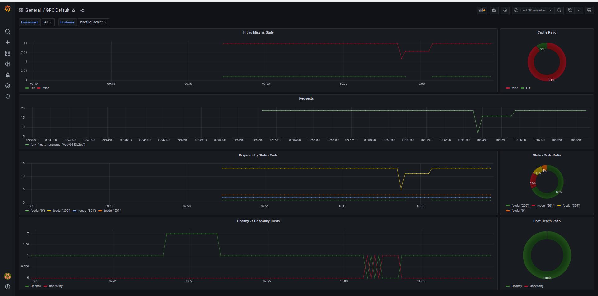

# Development

## Need tools

- Go v1.15
- make
- [wrk](https://github.com/wg/wrk)

## Setup

```console
docker build -t fabiocicerchia/go-proxy-cache-test:nginx -f test/full-setup/docker/Dockerfile.nginx test/full-setup
docker build -t fabiocicerchia/go-proxy-cache-test:node -f test/full-setup/docker/Dockerfile.node test/full-setup
echo "127.0.0.1 testing.local www.testing.local" | sudo tee -a /etc/hosts
cd test/full-setup/certs
./gen-selfsigned-cert.sh
./gen-selfsigned-cert.sh www.w3.org
cd ..
docker-compose up
```

## Tracing

Jaeger is available by using the `test/full-setup` demo and browsing to http://127.0.0.1:16686/.

Prometheus endpoint is available at http://127.0.0.1:52021/metrics, it could be queried via http://127.0.0.1:9090.  
Its metrics are collected and available via Grafana at http://localhost:3001.

There is a JSON export of the dashboard stored in `test/full-setup/grafana/gpc-dashboard.json`.



Note: the Data Source must be configured in Grafana to point to http://prometheus:9090.

## Logging

In case of testing Sentry, follow this steps:

- Start docker-compose.
- Run patching commands:
  - `SENTRY_SECRET_KEY=$(docker run --rm sentry config generate-secret-key)`
  - `docker run --network full-setup_default -it --rm -e SENTRY_REDIS_HOST=redis -e SENTRY_POSTGRES_HOST=postgres -e SENTRY_SECRET_KEY=$SENTRY_SECRET_KEY -e SENTRY_DB_USER=sentry -e SENTRY_DB_PASSWORD=secret --link full-setup_postgres_1:postgres --link full-setup_redis_1:redis sentry upgrade`
  - `docker run --network full-setup_default -it --rm -e SENTRY_REDIS_HOST=redis -e SENTRY_POSTGRES_HOST=postgres -e SENTRY_SECRET_KEY=$SENTRY_SECRET_KEY -e SENTRY_DB_USER=sentry -e SENTRY_DB_PASSWORD=secret --link full-setup_postgres_1:postgres --link full-setup_redis_1:redis sentry run worker`
- Configure new accounts in the [admin panel](http://127.0.0.1:9000/).
- Retrieve the Sentry DSN [here](http://127.0.0.1:9000/sentry/internal/getting-started/).
- Replace `127.0.0.1:9000` with `sentry:9000`.
- Change the setting `sentry_dsn` in the `config.yml` file.
- Stop docker-compose and start again.

## Test

```console
$ make test
[...]
```

## Monitor file descriptors

Launch wrk then:

```console
$ lsof -p PID | wc -l
```
