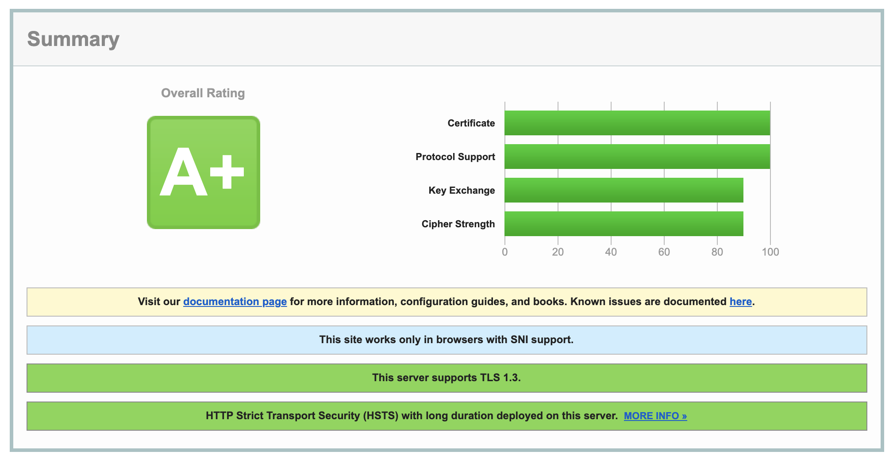

# Real World Case

## Configuration

### docker-compose

```yaml
version: '3.8'

services:
  goproxycache:
    image: fabiocicerchia/go-proxy-cache:latest
    restart: always
    network_mode: host
    volumes:
      - ./config.yml:/app/config.yml

  redis:
    image: redis:alpine
    restart: always
    ports:
      - "6379:6379"

  nginx:
    image: nginx:alpine
    restart: always
    ports:
      - "8080:80"
      - "8443:443"
    volumes:
      - [...]

  phpfpm:
    image: php:fpm-alpine
    restart: always
    ports:
      - "9000:9000"
    volumes:
      - [...]

  jaeger:
    image: jaegertracing/all-in-one:latest
    ports:
      - "14268:14268"
      - "16686:16686"
```

### go-proxy-cache

```yaml
### GLOBAL CONFIGURATION
################################################################################
server:
  # --- GENERIC
  port:
    http: "80"
    https: "443"
  # --- GZIP
  # Automatically enable GZip compression on all requests.
  gzip: false
  # --- INTERNALS
  internals:
    # Internal listening Address for metrics and healthchecks.
    # Default: 127.0.0.1
    listening_address: "127.0.0.1"
    # Internal listening port for metrics and healthchecks.
    # Default: 52021
    listening_port: 52021
  # --- TLS
  tls:
    # Automatic Certificate Management Environment
    # Provides automatic generation of SSL/TLS certificates from Let's Encrypt
    # and any other ACME-based CA.
    # Default: false (need to provide `cert_file` and `key_file`)
    auto: false
    # Email optionally specifies a contact email address.
    # This is used by CAs, such as Let's Encrypt, to notify about problems with
    # issued certificates.
    email: noreply@example.com
    # Pair or files: the certificate and the key.
    # Used by LoadX509KeyPair to read and parse a public/private key pair from a
    # pair of files. The files must contain PEM encoded data. The certificate
    # file may contain intermediate certificates following the leaf certificate
    # to form a certificate chain.
    cert_file: ~
    key_file: ~
    # WARNING: INTERNAL SERVER BEHAVIOUR
    override:
      # CipherSuites is a list of supported cipher suites for TLS versions up to
      # TLS 1.2. If CipherSuites is nil, a default list of secure cipher suites
      # is used, with a preference order based on hardware performance. The
      # default cipher suites might change over Go versions. Note that TLS 1.3
      # ciphersuites are not configurable.
      #
      # Value     Description                                    DLTS-OK   IANA Recommended
      # ------------------------------------------------------------------------------------
      # TLS 1.0 - 1.2 cipher suites.
      #   5     = TLS_RSA_WITH_RC4_128_SHA                       N         N
      #   10    = TLS_RSA_WITH_3DES_EDE_CBC_SHA                  Y         N
      #   47    = TLS_RSA_WITH_AES_128_CBC_SHA                   Y         N
      #   53    = TLS_RSA_WITH_AES_256_CBC_SHA                   Y         N
      #   60    = TLS_RSA_WITH_AES_128_CBC_SHA256                Y         N
      #   156   = TLS_RSA_WITH_AES_128_GCM_SHA256                Y         N
      #   157   = TLS_RSA_WITH_AES_256_GCM_SHA384                Y         N
      #   49159 = TLS_ECDHE_ECDSA_WITH_RC4_128_SHA               N         N
      #   49161 = TLS_ECDHE_ECDSA_WITH_AES_128_CBC_SHA           Y         N
      #   49162 = TLS_ECDHE_ECDSA_WITH_AES_256_CBC_SHA           Y         N
      #   49169 = TLS_ECDHE_RSA_WITH_RC4_128_SHA                 N         N
      #   49170 = TLS_ECDHE_RSA_WITH_3DES_EDE_CBC_SHA            Y         N
      #   49171 = TLS_ECDHE_RSA_WITH_AES_128_CBC_SHA             Y         N
      #   49172 = TLS_ECDHE_RSA_WITH_AES_256_CBC_SHA             Y         N
      #   49187 = TLS_ECDHE_ECDSA_WITH_AES_128_CBC_SHA256        Y         N
      #   49191 = TLS_ECDHE_RSA_WITH_AES_128_CBC_SHA256          Y         N
      #   49199 = TLS_ECDHE_RSA_WITH_AES_128_GCM_SHA256          Y         Y
      #   49195 = TLS_ECDHE_ECDSA_WITH_AES_128_GCM_SHA256        Y         Y
      #   49200 = TLS_ECDHE_RSA_WITH_AES_256_GCM_SHA384          Y         Y
      #   49196 = TLS_ECDHE_ECDSA_WITH_AES_256_GCM_SHA384        Y         Y
      #   52392 = TLS_ECDHE_RSA_WITH_CHACHA20_POLY1305_SHA256    Y         Y
      #   52392 = TLS_ECDHE_RSA_WITH_CHACHA20_POLY1305           Y         Y
      #   52393 = TLS_ECDHE_ECDSA_WITH_CHACHA20_POLY1305_SHA256  Y         Y
      #   52393 = TLS_ECDHE_ECDSA_WITH_CHACHA20_POLY1305         Y         Y
      #
      # TLS 1.3 cipher suites.
      #   4865 = TLS_AES_128_GCM_SHA256                          Y         Y
      #   4866 = TLS_AES_256_GCM_SHA384                          Y         Y
      #   4867 = TLS_CHACHA20_POLY1305_SHA256                    Y         Y
      #
      # TLS_FALLBACK_SCSV isn't a standard cipher suite but an indicator
      # that the client is doing version fallback. See RFC 7507.
      #   22016 = TLS_FALLBACK_SCSV                              Y         N
      #
      # More details on:
      # https://www.iana.org/assignments/tls-parameters/tls-parameters.xml
      # https://blogs.sap.com/2018/12/09/perfect-forward-secrecy-and-how-to-choose-pfs-based-cipher-suites/
      ciphersuites:
        - 49200 # TLS_ECDHE_RSA_WITH_AES_256_GCM_SHA384
        - 49196 # TLS_ECDHE_ECDSA_WITH_AES_256_GCM_SHA384
        - 52393 # TLS_ECDHE_ECDSA_WITH_CHACHA20_POLY1305_SHA256
        - 52392 # TLS_ECDHE_RSA_WITH_CHACHA20_POLY1305_SHA256
        # needed by HTTP/2
        - 49199 # TLS_ECDHE_RSA_WITH_AES_128_GCM_SHA256
        - 49195 # TLS_ECDHE_ECDSA_WITH_AES_128_GCM_SHA256
        - 4865 # TLS_AES_128_GCM_SHA256
      # MinVersion contains the minimum TLS version that is acceptable.
      # If zero, TLS 1.0 is currently taken as the minimum.
      #   769 = VersionTLS10
      #   770 = VersionTLS11
      #   771 = VersionTLS12
      #   772 = VersionTLS13
      minversion: 771 # VersionTLS12
      # MaxVersion contains the maximum TLS version that is acceptable.
      # If zero, the maximum version supported by this package is used,
      # which is currently TLS 1.3.
      #   769 = VersionTLS10
      #   770 = VersionTLS11
      #   771 = VersionTLS12
      #   772 = VersionTLS13
      maxversion: 772 # VersionTLS13
      # CurvePreferences contains the elliptic curves that will be used in
      # an ECDHE handshake, in preference order. If empty, the default will
      # be used. The client will use the first preference as the type for
      # its key share in TLS 1.3. This may change in the future.
      # CurveID is the type of a TLS identifier for an elliptic curve. See
      # https://www.iana.org/assignments/tls-parameters/tls-parameters.xml#tls-parameters-8.
      #
      # In TLS 1.3, this type is called NamedGroup, but at this time this library
      # only supports Elliptic Curve based groups. See RFC 8446, Section 4.2.7.
      #   23 = CurveP256
      #   24 = CurveP384
      #   25 = CurveP521
      #   29 = X25519
      #
      # Only use curves which have assembly implementations
      # https://github.com/golang/go/tree/master/src/crypto/elliptic
      curvepreferences:
        - 23 # CurveP256
  # --- TIMEOUT
  timeout:
    # It is the maximum duration for reading the entire request, including the
    # body.
    # Because it does not let Handlers make per-request decisions on each
    # request body's acceptable deadline or upload rate, most users will prefer
    # to use `read_header`. It is valid to use them both.
    read: 5s
    # It is the amount of time allowed to read request headers. The connection's
    # read deadline is reset after reading the headers and the Handler can
    # decide what is considered too slow for the body. If it is zero, the value
    # of `read` is used. If both are zero, there is no timeout.
    read_header: 2s
    # It is the maximum duration before timing out writes of the response. It is
    # reset whenever a new request's header is read. Like `read`, it does not
    # let Handlers make decisions on a per-request basis.
    write: 5s
    # It is the maximum amount of time to wait for the next request when
    # keep-alives are enabled. If is zero, the value of `read` is used. If both
    # ara zero, there is no timeout.
    idle: 20s
    # It runs the handler with the given time limit.
    handler: 15s
  # --- FORWARDING
  upstream:
    # Hostname to be used for requests forwarding.
    host: ~
    # Port to be used for requests forwarding.
    # Default: incoming connection.
    # Values: 80, 443.
    port: 8443
    # Endpoint scheme to be used when forwarding traffic.
    # Default: incoming connection.
    # Values: http, https, ws, wsss.
    scheme: https
    # Load Balancing Algorithm to be used when present multiple endpoints.
    # Allowed formats: ip-hash, least-connections, random, round-robin (default).
    balancing_algorithm: round-robin
    # List of IPs/Hostnames to be used as load balanced backend servers.
    # They'll be selected using the chosen algorithm (or round-robin).
    endpoints:
      - 127.0.0.1
    # Forces redirect from HTTP to HTTPS.
    # Default: false
    http_to_https: true
    # This allows to have communication between the proxy and the upstream in
    # case of invalid TLS certificate.
    # Can be disabled in the global config.
    # Default: false
    insecure_bridge: true
    # Status code to be used when redirecting HTTP to HTTPS.
    # Default: 301
    redirect_status_code: 301
    health_check:
      # Status codes for healthy node.
      # A list of space-separated status codes.
      status_codes:
        - 200
      # Timeout request time.
      timeout: ~
      # Interval frequency for health checks.
      interval: ~
      # Port to be used for requests forwarding.
      # Default: incoming connection.
      # Values: 80, 443.
      port: 443
      # Fallback scheme if endpoint doesn't provide it.
      scheme: https
      # Allow healthchecks on self-signed TLS certificates (or expired/invalid).
      # Default: false
      allow_insecure: false

# --- TRACING
tracing:
  # Endpoint for Local Jaeger Agent (eg: jaeger:6831)
  jaeger_endpoint: ~
  # Enable/Disable the tracing.
  enabled: false
  # Set the sampling ratio for tracing (float).
  # Default: 1.0
  sampling_ratio: 1.0

# --- CACHE
cache:
  # --- REDIS SERVER
  hosts: 
    - localhost:6379
  password: ~
  db: 0
  # --- TTL
  # Fallback storage TTL when saving the cache when no header is specified.
  # It follows the order:
  #  - If the cache is shared and the s-maxage response directives present, use
  #    its value, or
  #  - If the max-age response directive is present, use its value, or
  #  - If the Expires response header field is present, use its value minus the
  #    value of the Date response header field, or
  #  - Otherwise, no explicit expiration time is present in the response.
  #    A heuristic freshness lifetime might be applicable.
  # Default: 0
  ttl: 0
  # --- ALLOWED VALUES
  # Allows caching for different response codes.
  # Default: 200, 301, 302
  allowed_statuses:
    - 200
    - 301
    - 302
  # If the client request method is listed in this directive then the response
  # will be cached. "GET" and "HEAD" methods are always added to the list,
  # though it is recommended to specify them explicitly.
  # Default: HEAD, GET
  allowed_methods:
    - HEAD
    - GET

# --- CIRCUIT BREAKER
# WARNING: INTERNAL SERVER BEHAVIOUR
circuit_breaker:
  # Will start evaluating the failures after n requests as defined by the
  # threshold.
  threshold: 1
  # It'll open the circuit after `threshold` requests which are greater or
  # equal to the failure rate defined
  # (total failures / total requests).
  failurerate: 2
  # Interval is the cyclic period of the closed state
  # for the CircuitBreaker to clear the internal Counts.
  # If Interval is 0, the CircuitBreaker doesn't clear internal Counts during
  # the closed state.
  interval: 1ms
  # Timeout is the period of the open state,
  # after which the state of the CircuitBreaker becomes half-open.
  # If Timeout is 0, the timeout value of the CircuitBreaker is set to 60
  # seconds.
  timeout: 1ms
  # MaxRequests is the maximum number of requests allowed to pass through
  # when the CircuitBreaker is half-open.
  # If MaxRequests is 0, the CircuitBreaker allows only 1 request.
  maxrequests: 1

### PER DOMAIN CONFIGURATION OVERRIDE
################################################################################
domains:
  fabiocicerchia:
    server:
      upstream:
        host: fabiocicerchia.it
      tls:
        cert_file: /etc/letsencrypt/live/fabiocicerchia.it/fullchain.pem
        key_file: /etc/letsencrypt/live/fabiocicerchia.it/privkey.pem

  www_fabiocicerchia:
    server:
      upstream:
        host: www.fabiocicerchia.it
      tls:
        cert_file: /etc/letsencrypt/live/www.fabiocicerchia.it-0001/fullchain.pem
        key_file: /etc/letsencrypt/live/www.fabiocicerchia.it-0001/privkey.pem
```

## SSL Report



### Protocols

| Protocols | Supported |
|-----------|-----------|
| TLS 1.3 | Yes |
| TLS 1.2 | Yes |
| TLS 1.1 | No |
| TLS 1.0 | No |
| SSL 3 | No |
| SSL 2 | No |

### Cipher Suites

| TLS 1.3 (suites in server-preferred order) | |
|-|-|
| TLS_AES_128_GCM_SHA256 (0x1301)    (eq. 3072 bits RSA)  |128 |
| TLS_CHACHA20_POLY1305_SHA256 (0x1303)    (eq. 3072 bits RSA)  |256 |
| TLS_AES_256_GCM_SHA384 (0x1302)    (eq. 3072 bits RSA)  |256 |

| TLS 1.2 (suites in server-preferred order) | |
|-|-|
| TLS_ECDHE_RSA_WITH_AES_256_GCM_SHA384 (0xc030)    (eq. 3072 bits RSA)  |256 |
| TLS_ECDHE_RSA_WITH_CHACHA20_POLY1305_SHA256 (0xcca8)    (eq. 3072 bits RSA)  |256 |
| TLS_ECDHE_RSA_WITH_AES_128_GCM_SHA256 (0xc02f)    (eq. 3072 bits RSA)  |128 |

### Handshake Simulation

| | | | |
|-|-|-|-|
| Android 4.4.2 | RSA 2048 (SHA256) | TLS 1.2 | TLS_ECDHE_RSA_WITH_AES_256_GCM_SHA384 |
| Android 5.0.0 | RSA 2048 (SHA256) | TLS 1.2 | TLS_ECDHE_RSA_WITH_AES_128_GCM_SHA256 |
| Android 6.0 | RSA 2048 (SHA256) | TLS 1.2 > http/1.1 |  TLS_ECDHE_RSA_WITH_AES_128_GCM_SHA256 |
| Android 7.0 | RSA 2048 (SHA256) | TLS 1.2 > h2 | TLS_ECDHE_RSA_WITH_AES_256_GCM_SHA384 |
| Android 8.0 | RSA 2048 (SHA256) | TLS 1.2 > h2 | TLS_ECDHE_RSA_WITH_AES_256_GCM_SHA384 |
| Android 8.1 | - | TLS 1.3 | TLS_AES_128_GCM_SHA256 |
| Android 9.0 | - | TLS 1.3 | TLS_AES_128_GCM_SHA256 |
| BingPreview Jan 2015 | RSA 2048 (SHA256) | TLS 1.2 | TLS_ECDHE_RSA_WITH_AES_256_GCM_SHA384 |
| Chrome 49 / XP SP3 | RSA 2048 (SHA256) | TLS 1.2 > h2 | TLS_ECDHE_RSA_WITH_CHACHA20_POLY1305_SHA256 |
| Chrome 69 / Win 7 | RSA 2048 (SHA256) | TLS 1.2 > h2 | TLS_ECDHE_RSA_WITH_AES_256_GCM_SHA384 |
| Chrome 70 / Win 10 | - | TLS 1.3 | TLS_AES_128_GCM_SHA256 |
| Chrome 80 / Win 10 | - | TLS 1.3 | TLS_AES_128_GCM_SHA256 |
| Firefox 31.3.0 ESR / Win 7 | RSA 2048 (SHA256) | TLS 1.2 | TLS_ECDHE_RSA_WITH_AES_128_GCM_SHA256 |
| Firefox 47 / Win 7 | RSA 2048 (SHA256) | TLS 1.2 > h2 | TLS_ECDHE_RSA_WITH_CHACHA20_POLY1305_SHA256 |
| Firefox 49 / XP SP3 | RSA 2048 (SHA256) | TLS 1.2 > h2 | TLS_ECDHE_RSA_WITH_AES_256_GCM_SHA384 |
| Firefox 62 / Win 7 | RSA 2048 (SHA256) | TLS 1.2 > h2 | TLS_ECDHE_RSA_WITH_AES_256_GCM_SHA384 |
| Firefox 73 / Win 10 | - | TLS 1.3 | TLS_AES_128_GCM_SHA256 |
| Googlebot Feb 2018 | RSA 2048 (SHA256) | TLS 1.2 | TLS_ECDHE_RSA_WITH_AES_256_GCM_SHA384 |
| IE 11 / Win 7 Server sent fatal alert: handshake_failure |
| IE 11 / Win 8.1 Server sent fatal alert: handshake_failure |
| IE 11 / Win Phone 8.1 Server sent fatal alert: handshake_failure |
| IE 11 / Win Phone 8.1 Update Server sent fatal alert: handshake_failure |
| IE 11 / Win 10 | RSA 2048 (SHA256) | TLS 1.2 > h2 | TLS_ECDHE_RSA_WITH_AES_256_GCM_SHA384 |
| Edge 15 / Win 10 | RSA 2048 (SHA256) | TLS 1.2 > h2 | TLS_ECDHE_RSA_WITH_AES_256_GCM_SHA384 |
| Edge 16 / Win 10 | RSA 2048 (SHA256) | TLS 1.2 > h2 | TLS_ECDHE_RSA_WITH_AES_256_GCM_SHA384 |
| Edge 18 / Win 10 | RSA 2048 (SHA256) | TLS 1.2 > h2 | TLS_ECDHE_RSA_WITH_AES_256_GCM_SHA384 |
| Edge 13 / Win Phone 10 | RSA 2048 (SHA256) | TLS 1.2 > h2 | TLS_ECDHE_RSA_WITH_AES_256_GCM_SHA384 |
| Java 8u161 | RSA 2048 (SHA256) | TLS 1.2 | TLS_ECDHE_RSA_WITH_AES_256_GCM_SHA384 |
| Java 11.0.3 | - | TLS 1.3 | TLS_AES_128_GCM_SHA256 |
| Java 12.0.1 | - | TLS 1.3 | TLS_AES_128_GCM_SHA256 |
| OpenSSL 1.0.1l | RSA 2048 (SHA256) | TLS 1.2 | TLS_ECDHE_RSA_WITH_AES_256_GCM_SHA384 |
| OpenSSL 1.0.2s | RSA 2048 (SHA256) | TLS 1.2 | TLS_ECDHE_RSA_WITH_AES_256_GCM_SHA384 |
| OpenSSL 1.1.0k | RSA 2048 (SHA256) | TLS 1.2 | TLS_ECDHE_RSA_WITH_AES_256_GCM_SHA384 |
| OpenSSL 1.1.1c | - | TLS 1.3 | TLS_AES_128_GCM_SHA256 |
| Safari 6 / iOS 6.0.1 | Server sent fatal alert: handshake_failure |
| Safari 7 / iOS 7.1 | Server sent fatal alert: handshake_failure |
| Safari 7 / OS X 10.9 | Server sent fatal alert: handshake_failure |
| Safari 8 / iOS 8.4 | Server sent fatal alert: handshake_failure |
| Safari 8 / OS X 10.10 | Server sent fatal alert: handshake_failure |
| Safari 9 / iOS 9 | RSA 2048 (SHA256) | TLS 1.2 > h2 | TLS_ECDHE_RSA_WITH_AES_256_GCM_SHA384 |
| Safari 9 / OS X 10.11 | RSA 2048 (SHA256) | TLS 1.2 > h2 | TLS_ECDHE_RSA_WITH_AES_256_GCM_SHA384 |
| Safari 10 / iOS 10 | RSA 2048 (SHA256) | TLS 1.2 > h2 | TLS_ECDHE_RSA_WITH_AES_256_GCM_SHA384 |
| Safari 10 / OS X 10.12 | RSA 2048 (SHA256) | TLS 1.2 > h2 | TLS_ECDHE_RSA_WITH_AES_256_GCM_SHA384 |
| Safari 12.1.2 / MacOS 10.14.6 Beta | - | TLS 1.3 | TLS_AES_128_GCM_SHA256 |
| Safari 12.1.1 / iOS 12.3.1 | - | TLS 1.3 | TLS_AES_128_GCM_SHA256 |
| Apple ATS 9 / iOS 9 | RSA 2048 (SHA256) | TLS 1.2 > h2 | TLS_ECDHE_RSA_WITH_AES_256_GCM_SHA384 |
| Yahoo Slurp Jan 2015 | RSA 2048 (SHA256) | TLS 1.2 | TLS_ECDHE_RSA_WITH_AES_256_GCM_SHA384 |
| YandexBot Jan 2015 | RSA 2048 (SHA256) | TLS 1.2 | TLS_ECDHE_RSA_WITH_AES_256_GCM_SHA384 |

#### Not simulated clients (Protocol mismatch)

- Android 2.3.7
- Android 4.0.4
- Android 4.1.1
- Android 4.2.2
- Android 4.3
- Baidu Jan 2015
- IE 6 / XP
- IE 7 / Vista
- IE 8 / XP
- IE 8-10 / Win 7
- IE 10 / Win Phone 8.0
- Java 6u45
- Java 7u25
- OpenSSL 0.9.8y
- Safari 5.1.9 / OS X 10.6.8
- Safari 6.0.4 / OS X 10.8.4
